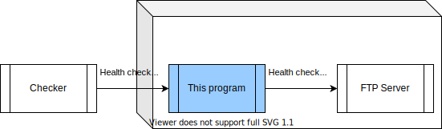

# http-status-for-ftp    /badge.svg)


[](https://goreportcard.com/report/github.com/transnano/http-status-for-ftp)

```sh
$ docker run -it --rm transnano/http-status-for-ftp:v0.0.3 --version

ftpchkr_exporter, version v0.0.3 (branch: docker, revision: 8fb6d14)
  build user:       root
  build date:       2020-07-29T05:18:24+0000
  go version:       go1.14.5
```

## Overview


